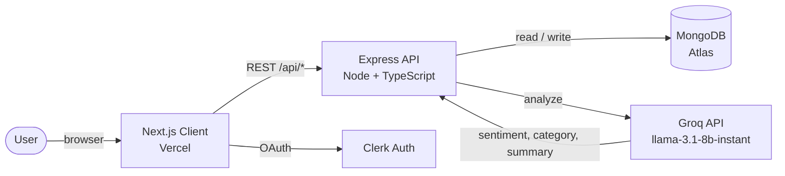

# FeedbackIQ

> Turn customer feedback into actionable insights — an LLM classifies, categorises, and summarises every entry automatically.

## Live Demo

**[feedbackiq.vercel.app](https://feedbackiq.vercel.app)**

Try it without an account: **[/report/demo](https://feedbackiq.vercel.app/report/demo)** — a public sample report.

---

## Features

- **AI-powered analysis** — sentiment, category, one-line summary, and a confidence score generated for every entry.
- **Manual + CSV submission** — paste a single entry or batch-upload up to 50 rows per request.
- **Stats dashboard** — totals, sentiment breakdown, top 5 categories, average confidence, plus pie + bar charts.
- **Filterable feedback grid** — slice by sentiment and category in real time.
- **Shareable public reports** — bundle any subset of feedback into a slug-addressed, read-only link viewable without sign-in.
- **OAuth sign-in** — Google and GitHub via Clerk, with per-user data isolation.
- **Rate-limited CSV uploads** — 3 per hour per IP to bound AI spend.
- **Graceful degradation** — feedback persists even if the AI call fails; analysis fields stay null and can be retried later.

---

## Tech Stack

| Layer       | Technology                                                          |
| ----------- | ------------------------------------------------------------------- |
| Frontend    | Next.js 14 (App Router), TypeScript, Tailwind CSS, Recharts         |
| Backend     | Node.js, Express, TypeScript, express-validator, express-rate-limit |
| Database    | MongoDB with Mongoose                                               |
| AI          | Groq API (`groq-sdk`) — `llama-3.1-8b-instant`                      |
| Auth        | Clerk (Google + GitHub OAuth)                                       |
| Deployment  | Vercel (frontend) · Railway / Render (backend) · MongoDB Atlas (DB) |

---

## Architecture Overview

A signed-in user submits feedback — manual entry or CSV upload — from the Next.js client. The request carries the user's Clerk `userId` and hits the Express API, which validates the payload and immediately persists a `Feedback` document to MongoDB. The server then calls the Groq API (`llama-3.1-8b-instant`) with a strict JSON-only prompt; the model returns `{ sentiment, category, summary, confidence }`, which are merged back into the same document. If the AI call fails, the entry stays in the database with analysis fields null — nothing is lost. The dashboard reads `/api/feedback` and `/api/feedback/stats` (both scoped by `userId`) to render the user's entries, stat cards, and charts. Any subset of entries can be packaged into a `Report` with an auto-generated slug; `/report/[slug]` is a public, read-only page that anyone can view without logging in.

```
                           ┌────────────────────────┐
                           │       Groq API         │
                           │ (llama-3.1-8b-instant) │
                           └───────────▲────────────┘
                                       │ JSON:
                                       │ { sentiment, category,
                                       │   summary, confidence }
                                       │
┌────────────┐   HTTPS    ┌────────────┴─────────┐    ┌──────────────┐
│            │ ─────────► │                      │ ──►│              │
│   Client   │  /api/...  │     Express API      │    │   MongoDB    │
│ (Next.js)  │ ◄───────── │   (Node + TS)        │ ◄──│   (Atlas)    │
│            │   JSON     │                      │    │              │
└─────┬──────┘            └──────────────────────┘    └──────────────┘
      │
      │ OAuth (Google / GitHub)
      ▼
┌────────────┐
│   Clerk    │
└────────────┘
```

<details>
<summary>Mermaid version</summary>



</details>

---

## Local Development

### Prerequisites

- **Node.js** ≥ 18.x
- **npm** ≥ 9.x (workspaces required)
- **MongoDB** — local (`mongod`) or a free [MongoDB Atlas](https://www.mongodb.com/atlas) cluster
- **Groq API key** — free tier at [console.groq.com](https://console.groq.com/)
- **Clerk application** — from [dashboard.clerk.com](https://dashboard.clerk.com/) with Google + GitHub providers enabled

### Clone and install

```bash
git clone https://github.com/KannupriyaArora/feedbackiq.git
cd feedbackiq
npm install
```

The repo is an npm workspace; a single `npm install` pulls dependencies for both `client/` and `server/`.

### Configure environment variables

```bash
cp client/.env.example client/.env.local
cp server/.env.example server/.env
```

#### `server/.env`

| Variable        | Description                                                                                       |
| --------------- | ------------------------------------------------------------------------------------------------- |
| `PORT`          | Port the API listens on. Defaults to `4000`.                                                      |
| `MONGODB_URI`   | Mongo connection string. Local example: `mongodb://localhost:27017/feedbackiq`.                   |
| `CLIENT_URL`    | Comma-separated list of allowed CORS origins. Wildcards supported (e.g. `https://*.vercel.app`).  |
| `GROQ_API_KEY`  | API key used by the AI service to call Groq. Without it, the server returns a neutral fallback.   |

#### `client/.env.local`

| Variable                                            | Description                                                |
| --------------------------------------------------- | ---------------------------------------------------------- |
| `NEXT_PUBLIC_API_URL`                               | URL of the Express backend (e.g. `http://localhost:4000`). |
| `NEXT_PUBLIC_CLERK_PUBLISHABLE_KEY`                 | Clerk publishable key (`pk_test_…`).                       |
| `CLERK_SECRET_KEY`                                  | Clerk secret key (`sk_test_…`).                            |
| `NEXT_PUBLIC_CLERK_SIGN_IN_URL`                     | `/sign-in`                                                 |
| `NEXT_PUBLIC_CLERK_SIGN_UP_URL`                     | `/sign-up`                                                 |
| `NEXT_PUBLIC_CLERK_SIGN_IN_FALLBACK_REDIRECT_URL`   | `/dashboard`                                               |
| `NEXT_PUBLIC_CLERK_SIGN_UP_FALLBACK_REDIRECT_URL`   | `/dashboard`                                               |

### Run both apps concurrently

From the project root:

```bash
npm run dev
```

Runs the client (port `3000`) and server (port `4000`) in parallel via [`concurrently`](https://www.npmjs.com/package/concurrently) with colour-coded prefixes.

To run them individually:

```bash
npm run dev --workspace=client    # http://localhost:3000
npm run dev --workspace=server    # http://localhost:4000
```

### Other scripts

```bash
npm run build      # build both workspaces
npm run lint       # eslint both workspaces
npm run format     # prettier across the repo
```

---

## API Endpoints

Base URL: `http://localhost:4000` (dev) — all responses are JSON.

| Method | Route                            | Description                                                                              |
| ------ | -------------------------------- | ---------------------------------------------------------------------------------------- |
| GET    | `/api/health`                    | Liveness probe. Returns `{ status: "ok", timestamp }`.                                   |
| POST   | `/api/feedback`                  | Submit a single entry. Body: `{ userId, rawText, source: "manual" \| "csv" }`.           |
| POST   | `/api/feedback/csv`              | Upload a CSV (`multipart/form-data` field `file`, plus `userId`). Rate-limited 3/hr/IP, max 50 rows. |
| GET    | `/api/feedback?userId=…`         | List a user's feedback, newest first. Optional `source` query filter.                    |
| GET    | `/api/feedback/stats?userId=…`   | Aggregate stats: totals, sentiment counts, top 5 categories, average confidence.         |
| POST   | `/api/reports`                   | Create a shareable report. Body: `{ title, feedbackIds: ObjectId[] }`. Returns `{ slug }`. Max 500 entries. |
| GET    | `/api/reports/:slug`             | Fetch a public report (populated entries + computed stats). No auth required.            |

---

## Folder Structure

```
feedbackiq/
├── client/                          # Next.js 14 frontend
│   ├── app/
│   │   ├── page.tsx                 # Landing page
│   │   ├── dashboard/page.tsx       # Authenticated dashboard (stats, charts, grid)
│   │   ├── submit/page.tsx          # Manual + CSV feedback submission
│   │   ├── report/[slug]/page.tsx   # Public shareable report
│   │   ├── sign-in/[[...sign-in]]/  # Clerk OAuth sign-in
│   │   ├── sign-up/[[...sign-up]]/  # Clerk OAuth sign-up
│   │   ├── sso-callback/page.tsx    # OAuth redirect handler
│   │   ├── layout.tsx               # ClerkProvider + Navbar
│   │   └── globals.css
│   ├── components/
│   │   ├── Navbar.tsx
│   │   ├── Button.tsx               # Shared primary/secondary/outline button
│   │   ├── ChartsSection.tsx        # Pie + bar charts (Recharts)
│   │   └── UserMenu.tsx             # Avatar dropdown with sign-out
│   ├── middleware.ts                # Clerk route protection (/dashboard, /submit)
│   └── public/
│       └── sample.csv               # Template for CSV upload
│
├── server/                          # Express API
│   ├── src/
│   │   ├── index.ts                 # App entry: CORS, JSON, route mounting
│   │   ├── config/
│   │   │   └── db.ts                # Mongoose connection
│   │   ├── models/
│   │   │   ├── Feedback.ts          # userId, rawText, source, sentiment, category, …
│   │   │   └── Report.ts            # title, slug (unique), feedbackIds, createdAt
│   │   ├── routes/
│   │   │   ├── health.ts            # GET /api/health
│   │   │   ├── feedbackRoutes.ts    # Feedback CRUD, CSV upload, stats
│   │   │   └── reportRoutes.ts      # Create + fetch shareable reports
│   │   ├── services/
│   │   │   └── aiService.ts         # Groq SDK wrapper, JSON validation, fallback
│   │   └── middleware/
│   │       └── errorHandler.ts
│   ├── Procfile                     # Railway/Heroku-style start command
│   └── railway.json
│
├── package.json                     # npm workspaces (client, server)
└── README.md
```

---

## Future Improvements

- **Server-side auth verification** — `userId` is currently trusted from the client; verify Clerk JWTs server-side with `@clerk/backend`'s `verifyToken` and derive `userId` from the verified session.
- **Background job queue** — move AI analysis to a worker (BullMQ + Redis) so submissions return instantly and analysis happens out-of-band, with retries, backoff, and a dead-letter queue.
- **Streaming AI responses** — stream tokens to the client on the manual-submit flow for faster perceived latency.
- **Pagination + virtualisation** — `/api/feedback` currently returns the full list; switch to cursor pagination and virtualise the dashboard grid for users with thousands of entries.
- **Full-text search** — Atlas Search index over `rawText` + `summary` so users can search their corpus.
- **Webhook ingestion** — accept feedback from Intercom, Zendesk, and Typeform via signed webhooks instead of CSV-only batch.
- **Per-user tiers & billing** — Stripe integration with monthly analysis quotas tracked in Mongo.
- **Observability** — structured logging (pino), request tracing (OpenTelemetry), and an error-tracking SDK (Sentry).
- **Test coverage** — Vitest for route + service unit tests, Playwright for the critical client flows (sign-in, submit, generate report).
- **CI/CD** — GitHub Actions running lint + typecheck + tests on every PR; preview deployments per branch on Vercel + Railway.
- **Re-analyse on demand** — a "re-run analysis" button on a feedback card to retry failed AI calls or refresh stale categorisations after a prompt change.
- **Export reports** — download a report as CSV or PDF in addition to the public link.

---

## License

MIT — see [LICENSE](./LICENSE).
